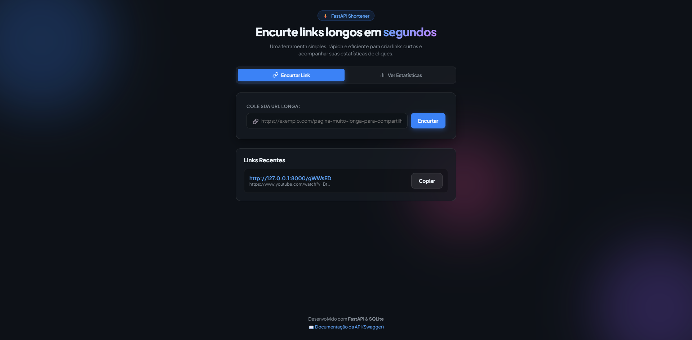

# Encurtador de URLs

## Sobre o projeto
Um aplicativo web full-stack para encurtamento de URLs e acompanhamento de estatísticas de acessos. O sistema permite que o usuário transforme links longos em códigos curtos e fáceis de compartilhar, redirecionando os visitantes automaticamente para a URL de destino e registrando o total de cliques em tempo real.

<p align="center">
  
</p>

---

## Funcionalidades
- **Encurtamento de URLs**: Gera links curtos alfanuméricos e únicos para qualquer URL informada.
- **Prevenção de Duplicatas**: Retorna o link encurtado existente caso a URL já tenha sido cadastrada.
- **Redirecionamento Automático**: Redireciona o usuário para a URL original com status HTTP 307.
- **Contagem de Cliques em Tempo Real**: Incrementa automaticamente as visualizações a cada acesso ao link encurtado.
- **Painel de Estatísticas**: Consulta detalhada com total de cliques, link original e data de criação.
- **Interface Web Moderna**: Design responsivo com efeitos de *Glassmorphism*, tema escuro e suporte para cópia rápida do link.
- **Documentação Interativa (Swagger)**: Interface pronta para testar os endpoints da API via Swagger UI.

---

## Tecnologias

### Frontend
- **HTML5** (Semântico)
- **CSS3** (Variáveis CSS, Efeitos Glassmorphism, Layout Responsivo com Flexbox e Grid)
- **JavaScript (Vanilla ES6+)** (Async/Await, Fetch API, Clipboard API, LocalStorage)

### Backend
- **Python (3.12+)**
- **FastAPI** (Framework web de alta performance)
- **Uvicorn** (Servidor ASGI)
- **SQLAlchemy** (ORM para persistência de dados)
- **SQLite** (Banco de dados relacional local)
- **Pydantic v2** (Validação e serialização de dados)

---

## Estrutura do projeto

```text
url_shortner_fastapi/
├── app/
│   ├── models/            # Modelos ORM do SQLAlchemy
│   │   ├── __init__.py
│   │   └── url.py
│   ├── schemas/           # Schemas de validação e serialização Pydantic
│   │   ├── __init__.py
│   │   └── url.py
│   ├── static/            # Arquivos do front-end (HTML, CSS, JS)
│   │   ├── index.html
│   │   ├── style.css
│   │   └── script.js
│   ├── utils/             # Utilitários e geradores de código curto
│   │   ├── __init__.py
│   │   └── short_code.py
│   ├── __init__.py
│   ├── database.py        # Configuração do banco de dados e sessão
│   └── main.py            # Inicialização do FastAPI, middlewares e rotas
├── requirements.txt       # Dependências do projeto Python
├── url_shortener.db       # Banco de dados SQLite local
└── README.md
```

---

## Pré-requisitos
- **Python (v3.12 ou superior)**
- **Git** (opcional, para clonar o repositório)

---

## Instalação

1. Abra o terminal e navegue até a pasta raiz do projeto:
   ```bash
   cd url_shortner_fastapi
   ```

2. Crie o ambiente virtual Python:
   ```bash
   python -m venv .venv
   ```

3. Ative o ambiente virtual:
   - **Windows (PowerShell):**
     ```powershell
     .\.venv\Scripts\activate
     ```
   - **Windows (CMD):**
     ```cmd
     .\.venv\Scripts\activate.bat
     ```
   - **Linux / macOS:**
     ```bash
     source .venv/bin/activate
     ```

4. Instale as dependências:
   ```bash
   pip install -r requirements.txt
   ```

---

## Como executar

Com o ambiente virtual ativado na **pasta raiz do projeto**, execute:

```bash
uvicorn app.main:app --reload
```

Ou diretamente pelo módulo Python do ambiente virtual:

```powershell
.\.venv\Scripts\python -m uvicorn app.main:app --reload
```

- **Interface Web:** Acesse [http://127.0.0.1:8000](http://127.0.0.1:8000) no seu navegador.
- **Documentação Swagger:** Acesse [http://127.0.0.1:8000/docs](http://127.0.0.1:8000/docs).
- **Documentação ReDoc:** Acesse [http://127.0.0.1:8000/redoc](http://127.0.0.1:8000/redoc).

---

## Rotas da API

### `GET /`
Retorna a interface web do front-end (`index.html`).

### `POST /shorten`
Encurta uma URL longa e salva no banco de dados.
- **Corpo da requisição (JSON):**
  ```json
  {
    "original_url": "https://fastapi.tiangolo.com/"
  }
  ```
- **Resposta de sucesso (201 Created):**
  ```json
  {
    "id": 1,
    "original_url": "https://fastapi.tiangolo.com/",
    "short_code": "Ba9ymF",
    "clicks": 0,
    "created_at": "2026-08-29T16:00:00.000000"
  }
  ```

### `GET /{short_code}`
Busca a URL original a partir do código curto, incrementa a contagem de cliques e realiza o redirecionamento (status `307 Temporary Redirect`).

### `GET /stats/{short_code}`
Retorna as estatísticas de acesso de uma URL encurtada.
- **Resposta de sucesso (200 OK):**
  ```json
  {
    "id": 1,
    "original_url": "https://fastapi.tiangolo.com/",
    "short_code": "Ba9ymF",
    "clicks": 15,
    "created_at": "2026-08-29T16:00:00.000000"
  }
  ```

---

## Exemplos de requisições

### Encurtar uma URL utilizando cURL:
```bash
curl -X POST http://127.0.0.1:8000/shorten \
  -H "Content-Type: application/json" \
  -d "{\"original_url\": \"https://fastapi.tiangolo.com/\"}"
```

### Consultar estatísticas de um código:
```bash
curl -X GET http://127.0.0.1:8000/stats/Ba9ymF
```

---

## Testes

Para testar a importação e o funcionamento dos endpoints diretamente via script de validação:

```powershell
.\.venv\Scripts\python -c "import app.main; print('Aplicação carregada com sucesso!')"
```

---

## Autor

Vitor Nery — [GitHub (@vitor-nery11)](https://github.com/vitor-nery11)
